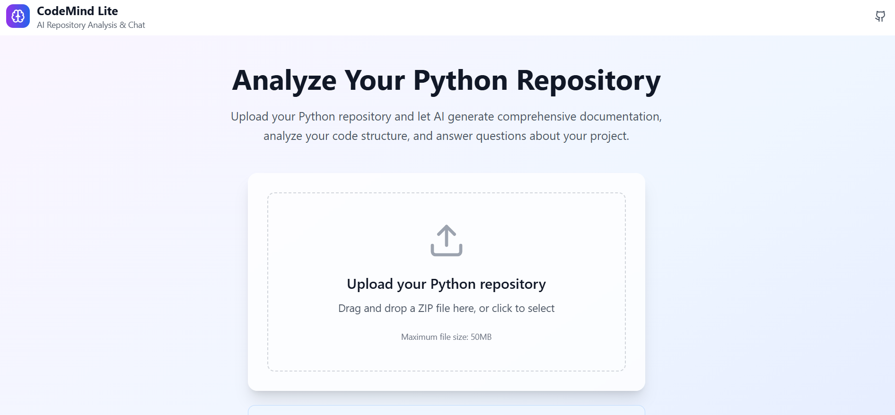

# CodeMind Lite - Backend

FastAPI backend for the CodeMind Lite AI repository analysis tool. Uses Grok-4 AI via OpenRouter for intelligent code analysis and chat functionality.



## ✨ Features

- **Repository Upload**: Process Python repository ZIP files
- **AI Chat**: Natural language queries about uploaded code using Grok-4
- **Documentation Generation**: AI-powered README and docstring generation
- **Code Analysis**: Extract and analyze Python files
- **Health Monitoring**: Health check endpoint for deployment
- **CORS Support**: Cross-origin requests for frontend integration

## 🚀 Local Development Setup

### Prerequisites

- Python 3.8+
- pip
- OpenRouter API key (optional, for AI features)

### Installation

1. **Navigate to backend directory:**

   ```bash
   cd backend
   ```

2. **Install dependencies:**

   ```bash
   pip install -r requirements.txt
   ```

3. **Configure environment:**

   ```bash
   cp .env.example .env
   ```

   Edit `.env` and set your configuration:

   ```env
   OPENROUTER_API_KEY=your_openrouter_api_key_here    ###Grok-4 AI API KEY
   OPENROUTER_BASE_URL=https://openrouter.ai/api/v1
   HOST=0.0.0.0
   PORT=10000
   DEBUG=True
   CORS_ORIGINS=http://localhost:5175,http://127.0.0.1:5175
   ```

4. **Start development server:**

   ```bash
   cd backend
   python -m app.main
   ```

   Or using uvicorn directly:

   ```bash
   cd backend
   uvicorn app.main:app --reload --host 0.0.0.0 --port 10000
   ```

   API will be available at [http://localhost:10000](http://localhost:10000)

## 🔑 OpenRouter API Setup

1. **Get API Key:**

   - Go to [OpenRouter](https://openrouter.ai/)
   - Sign up for a free account
   - Get your API key from the dashboard

2. **Free Grok-4 Model:**

   - The backend uses `x-ai/grok-4-fast:free` which is free on OpenRouter
   - No credit card required for basic usage

3. **Set Environment Variable:**
   ```bash
   export OPENROUTER_API_KEY="your_key_here"
   ```

## 🛠️ API Endpoints

### Core Endpoints

| Method | Endpoint         | Description                   |
| ------ | ---------------- | ----------------------------- |
| `GET`  | `/health`        | Health check for deployment   |
| `POST` | `/upload`        | Upload Python repository ZIP  |
| `POST` | `/chat`          | Chat with uploaded repository |
| `POST` | `/generate_docs` | Generate AI documentation     |
| `GET`  | `/repositories`  | List uploaded repositories    |

### Upload Repository

```bash
curl -X POST http://localhost:10000/upload \
  -F "file=@sample_repo.zip"
```

Response:

```json
{
  "id": "repo_1",
  "name": "sample_repo",
  "uploaded_at": "2024-01-01T00:00:00Z",
  "file_count": 5
}
```

### Chat with Repository

```bash
curl -X POST http://localhost:10000/chat \
  -H "Content-Type: application/json" \
  -d '{
    "repo_id": "repo_1",
    "message": "What does main.py do?"
  }'
```

Response:

```json
{
  "message": "The main.py file serves as the entry point for your application...",
  "relevant_files": ["main.py", "utils.py", "config.py"]
}
```

## 🧠 AI Integration

### Grok-4 via OpenRouter

The backend uses Google's Grok-4 model through OpenRouter:

- **Free Usage**: No cost for usage
- **Fast Responses**: Optimized for quick code analysis
- **Fallback Mode**: Works without API key with basic responses

### Features

- **Code Analysis**: Understands Python code structure
- **Natural Language**: Ask questions in plain English
- **Context Awareness**: Maintains context about uploaded repositories
- **Error Handling**: Graceful fallback when AI is unavailable

## 📁 Project Structure

```
backend/
├── app/
│   ├── main.py              # FastAPI application entry point
│   ├── routes/              # API route handlers
│   │   ├── upload.py        # Repository upload endpoint
│   │   ├── docs.py          # Documentation generation
│   │   ├── chat.py          # Chat with repository
│   │   └── health.py        # Health check endpoint
│   ├── services/            # Business logic services
│   │   ├── ai_service.py    # Grok-4 AI integration
│   │   └── utils.py         # Utility functions
│   └── models/              # Pydantic data models
│       └── schemas.py       # Request/response schemas
├── requirements.txt         # Python dependencies
├── .env.example            # Environment variables template
└── README.md              # This file
```

## 🧪 Testing

### Manual Testing

```bash
# Test health endpoint
curl http://localhost:10000/health

# Test with sample repository
curl -X POST http://localhost:10000/upload \
  -F "file=@test_repo.zip"

# Test chat functionality
curl -X POST http://localhost:10000/chat \
  -H "Content-Type: application/json" \
  -d '{"repo_id": "repo_1", "message": "Explain the code structure"}'
```

### API Documentation

Visit [http://localhost:10000/docs](http://localhost:10000/docs) for interactive API documentation.

## 🚨 Troubleshooting

### Common Issues

1. **Port already in use**

   ```bash
   # Kill process on port 10000
   lsof -ti:10000 | xargs kill -9
   ```

2. **Module import errors**

   ```bash
   # Ensure you're in the backend directory
   cd backend
   python -m app.main
   ```

3. **File upload fails**

   - Check file size (max 50MB)
   - Ensure file is a valid ZIP
   - Verify ZIP contains Python files

4. **AI responses not working**
   - Check OPENROUTER_API_KEY in .env
   - Verify OpenRouter account has credits
   - Check logs for API errors

## 🔧 Configuration

### Environment Variables

| Variable              | Description                   | Default                        |
| --------------------- | ----------------------------- | ------------------------------ |
| `OPENROUTER_API_KEY`  | OpenRouter API key for Grok-4 | None                           |
| `OPENROUTER_BASE_URL` | OpenRouter API base URL       | `https://openrouter.ai/api/v1` |
| `HOST`                | Server host                   | `0.0.0.0`                      |
| `PORT`                | Server port                   | `10000`                        |
| `DEBUG`               | Debug mode                    | `True`                         |
| `CORS_ORIGINS`        | Allowed CORS origins          | `http://localhost:5175`        |

### File Upload Limits

- **Maximum file size**: 50MB
- **Supported formats**: ZIP files only
- **File types processed**: Python (.py) files
- **Storage**: Temporary filesystem storage

## 📄 License

This project is part of CodeMind Lite - an educational tool for learning AI-powered code analysis.
